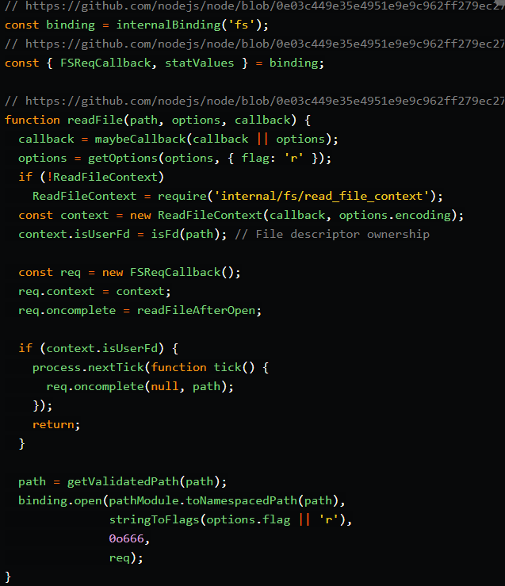

# Our example - I/O function call

If we look at Node.JS source code we will see two folders lib and src the lib folder contains all Javascript definitions and functions that we require into our projects.

The src folder is 100% C++ implementations, this is where V8 resides and all implementations of modules like fs, http and crypto... etc..

In the IO.js file we have a simple code that reads a file.

fs.readFile is not either part of V8 or JavaScript. 

This function is solely implemented by Node.js as a C++ binding to the local OS, however, the high-level API we use as fs.readFile(path, cb) is fully implemented in JavaScript, which calls those bindings.

This code is requiring a fs binding with internalBinding which is a private C++ binding loader and it's not accessible to us because they're available at NativeModule.require, this is where really loads C++ and when we depend on V8.

internalBinding('fs') calls and loads a .cc file which is src/node_file.cc that is a file that contains all C++ implementations for FSReqCallback and statValues functions.

FSReqCallback is an async callback used when we call fs.readFile
